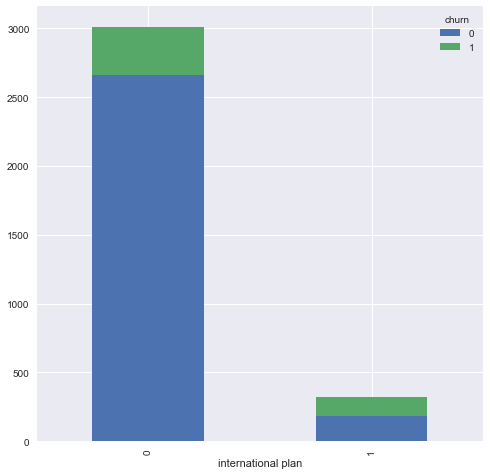

# Predicting Churn Rate in Telecommunications Customers

## Project Overview

The goal of this project is to reduce customer churn rate for SyriaTel, a telecommunications company in Syria with several million customers. This dataset is based in the US, so it is important for model results to extrapolate to an application in Syria. To reduce customer churn rate, it is important to identify customers that are likely to churn, why these customers churn, and deploy a customer retention strategy on these customers.

### The Data
The data comes from a Kaggle dataset located here: https://www.kaggle.com/datasets/becksddf/churn-in-telecoms-dataset
The original dataset is from a CrowdAnalytix competition. There are 3,333 total data points in the set, twenty-one different variables, and 85.5% of the dataset is represented by customers that did not churn while the remaining 14.5% is represented by customers that churned. This dataset is anonymized, but the data is orginally from the United States. The variables in the dataset include items such as which US state the customer is located, how many calls the customer has made, whether or not the customer has an international plan, and many others. 

### Methods

First, an exploratory data analysis was created. This initial analysis allowed for the evaluation of trends in the data. For instance, customers with an international plan had a high churn rate in comparison to customers that did have one.

