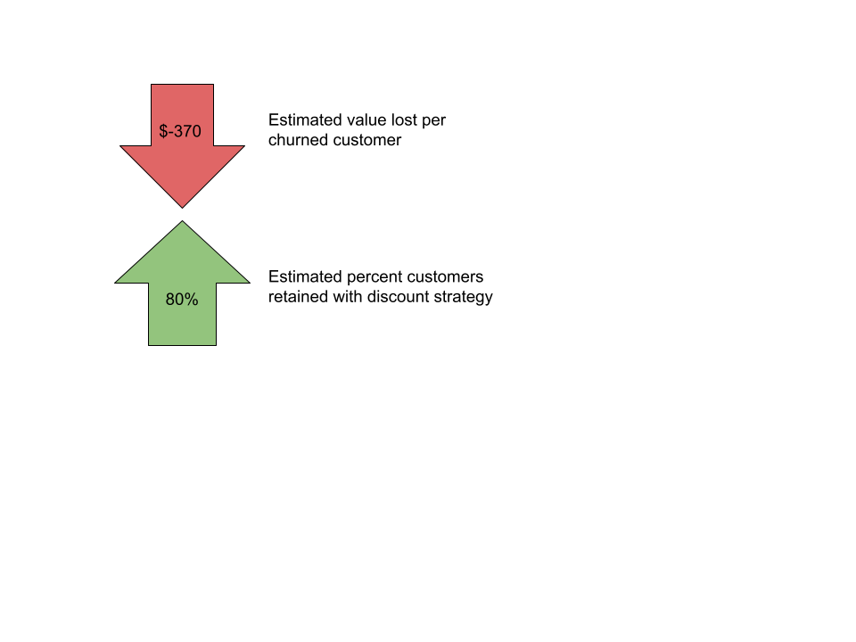
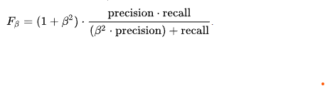

# Predicting Churn Rate in Telecommunications Customers

## Project Overview

The goal of this project is to reduce customer churn rate for SyriaTel, a telecommunications company in Syria with several million customers. This dataset is based in the US, so it is important for model results to extrapolate to an application in Syria. To reduce customer churn rate, it is important to identify customers that are likely to churn, why these customers churn, and deploy a customer retention strategy on these customers.

### The Data
The data comes from a Kaggle dataset located here: https://www.kaggle.com/datasets/becksddf/churn-in-telecoms-dataset
The original dataset is from a CrowdAnalytix competition. There are 3,333 total data points in the set, twenty-one different variables, and 85.5% of the dataset is represented by customers that did not churn while the remaining 14.5% is represented by customers that churned. This dataset is anonymized, but the data is orginally from the United States. The variables in the dataset include items such as which US state the customer is located, how many calls the customer has made, whether or not the customer has an international plan, and many others. 

### Methods

First, an exploratory data analysis (EDA) was created. This initial analysis allowed for the evaluation of trends in the data. For instance, customers with an international plan had a high churn rate in comparison to customers that did have one.

Green represents customers that churned while blue represents customers that did not change. The churn rate for customers with an international plan is an astonishing 42.41%, and the churn rate for customers without one is 11.5%. After further investigation of customers with an international plan, it seems that these customers do not receive any discount on costs incurred from international calls. 
The next inference made in the EDA was that customers with four or more calls to customer service are likely to churn.

As depicted in the barplot, customers that have made four calls to customer service are almost 50% likely to churn, and the rate gets increasingly worse with more calls to customer service.
Another inference made in the EDA was that customers with a voice mail plan are significantly less likely to churn than customers without a voice mail plan.

The last main finding in the EDA was that customers that pay more than others are more likely to churn. However, more analysis past the EDA is required to understand the tradeoff between cost and benefit of gaining more revenue from higher-paying customers while sacrificing a higher churn rate.
The main recommendations for SyriaTel in regards to the EDA are to ensure that international plans offer comprehensive solutions to international call needs and to ensure that customers that reach out to customer service multiple times have their issues resolved as quickly as possible. It may also be worthwhile to include a voice mail plan for free or discount the price to customers that have stayed with the company for a certain amount of time and still do not have a voice mail plan. Other strategies to reduce churn rate in customers paying more should be considered as well.
Machine learning techniques were applied to the dataset to explore predictive modeling approaches for identifying customers who churn. 

### Evaluating the Success of Models - Retention Strategy
A general strategy to retain customers is to offer customers, that are predicted as likely to churn, a discounted rate on their payments for a certain amount of months. The strategy for this project is to offer customers likely to churn a discount of 50% for 6 months. This offer seems like it would be attractive to most people because 50% is a significant chunk off the typical cost of $70/month that is [paid by single users in the US](https://www.usmobile.com/blog/cut-cell-phone-bill/). This project also assumes that customers that churn cost the company an estimated $370 because the [average cost to acquire a new customer is about $300 in US telecommunications companies](https://www.forbes.com/sites/forbestechcouncil/2020/10/30/acquiring-subscribers-is-only-half-the-battle/https://www.entrepreneur.com/article/225415), which is then added to the loss of one month ($70). It is also assumed that customers offered the discount will be retained 80% of the time. This chance is of course an estimation, and the implementation of this retention strategy would require a more rigorous estimation process.

### Evaluating the Success of Models - F-2 Score
To evaluate performance between the different models used in this project, the F-2 Score metric is used. F-2 is a modified version of a more-typical model evaluation metric used in machine learning- F-1. Both F-1 and F-2 are derived from the same general formula for F Beta Score. The formula can be visualized below:

Or, in terms of type I (false positives) and type II errors (false negatives). 

The basic premise of utilizing the F-2 Score to evaluate model performance in this project is to penalize False Negatives more than False Positives. F-2 is used for inter-model performance evaluation, as opposed to using a generalized cost-benefit derived from the retention strategy above, in order to detach performance from the previous assumptions. Even if there are issues in how new customer acquisition cost is calculated, how successful the retention strategy is, or even what kind of retention strategy is used, it can be pretty safe to assume that False Negatives will result in more cost to the company than False Positives. The reason for this safe assumption resonates in the idea that False Negatives (customers identified as retained but actually churned) will represent a full loss to the company (estimated at $370 in this case). False Positives cost SyriaTel less because these customers are offered a retention strategy (such as a discount), and the only cost SyriaTel faces from these customers is the cost of the retention plan. In this instance, False Positives cost SyriaTel $210 (60% off $70/month plan for six months). It is important to note that True Negatives (customers correctly predicted as churning), are expected to gain $54 per customer. This added value is an expected value calculation adding the value added per retained customer assuming an 80% retention rate (.8 * (-210+370)) and subtracting the amount that is lost from 20% of customers leaving despite being offered the discount (.2 * 370). The retained customers in this calculation accounts for the amount lost due to the discount plan and the amount saved from not losing the customer.

### Baseline Model - Logistic Regression
